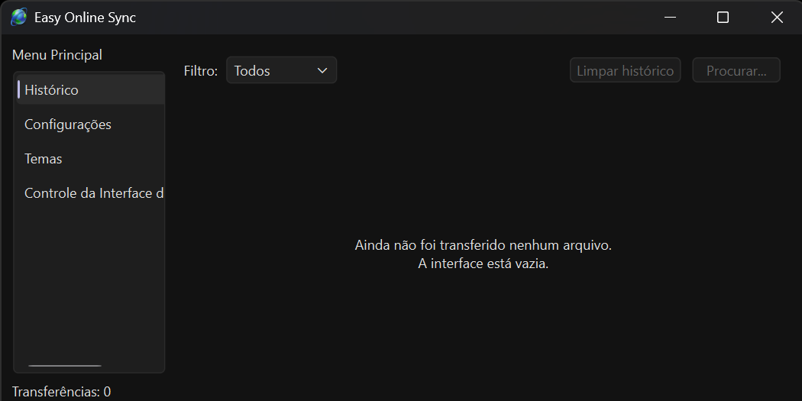
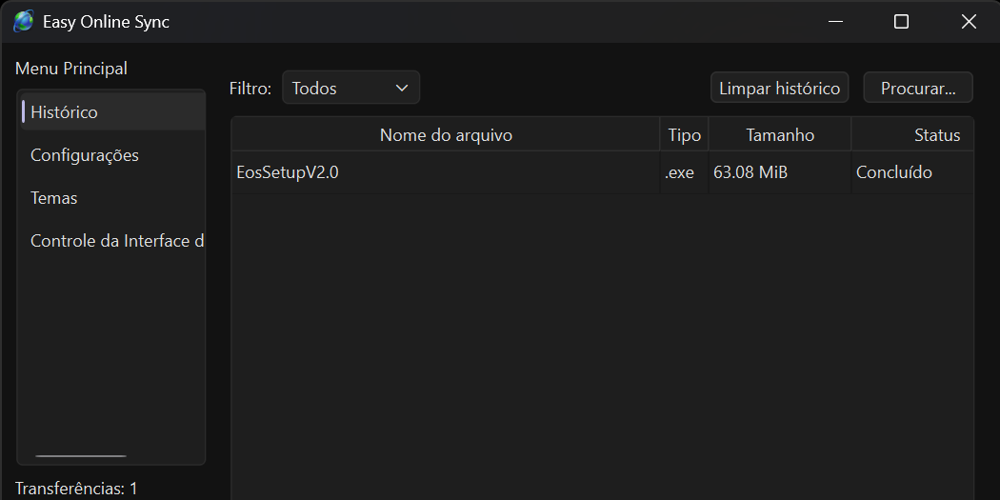
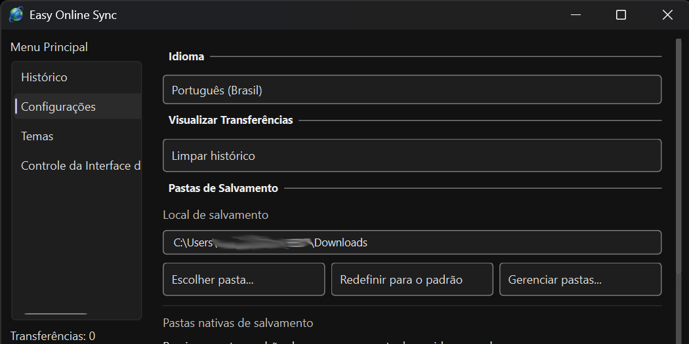
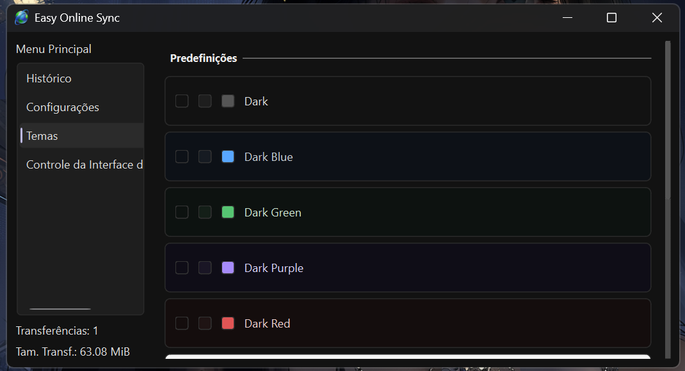
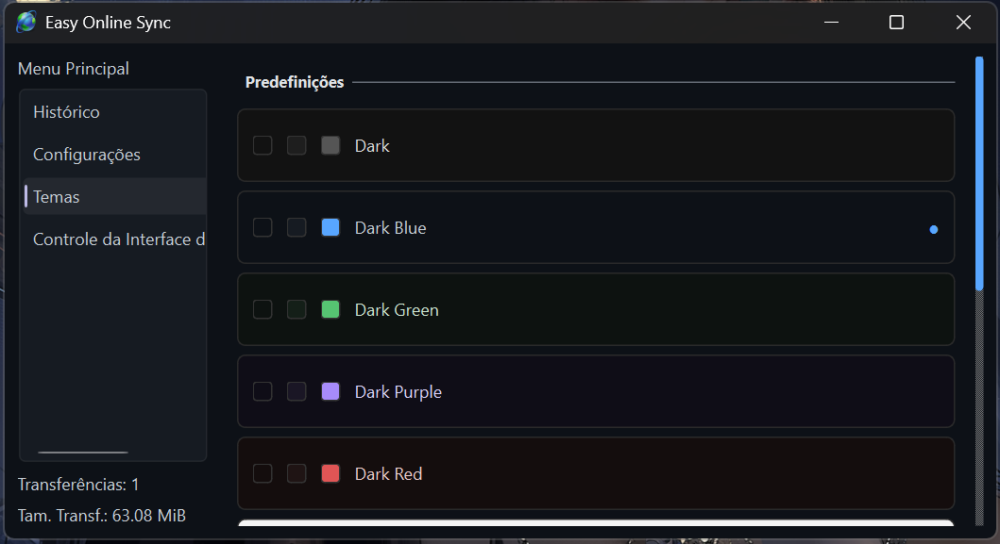
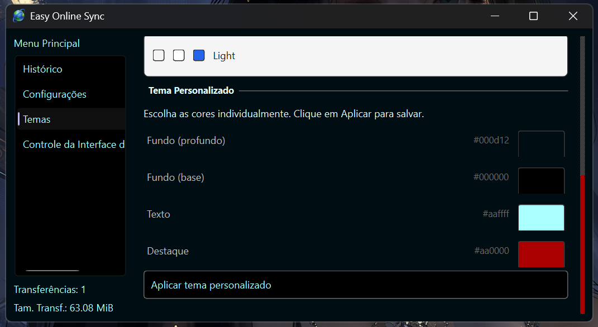

# Easy Online Sync

**Easy Online Sync** é um programa para Windows que detecta e baixa vídeos de qualquer site automaticamente, sem que você precise copiar links ou usar outros programas. Basta navegar normalmente e o programa cuida do resto.

---

## Como Funciona

Ao abrir o Easy Online Sync pela primeira vez, a janela principal aparece na tela. A partir daí, você pode minimizá-la ou fechar — o programa continua rodando silenciosamente na bandeja do sistema (aquela área perto do relógio, no canto inferior direito da tela).

Enquanto você navega, o programa fica monitorando os vídeos que aparecem nas páginas. Quando um vídeo é detectado, um botão discreto aparece diretamente sobre o player — sem abrir janelas, sem interromper o que você está fazendo. Clique no botão, escolha o que baixar, e pronto.

---

## Primeiros Passos

1. Instale o Easy Online Sync usando o instalador
2. Instale a extensão do navegador (disponível para **Firefox** e **Chrome**)
3. Abra o programa — a janela principal aparecerá automaticamente
4. Navegue normalmente. O botão de download aparecerá sobre os vídeos detectados

> Fechar a janela principal não encerra o programa. Ele continua ativo na bandeja do sistema. Para encerrar completamente, clique com o botão direito no ícone da bandeja e escolha **Encerrar**.

---

## O Botão de Download

Quando o Easy Online Sync detecta um vídeo na página, um botão compacto aparece sobre o player com a opção de download.

Ao clicar nele, um pequeno painel se abre listando todas as mídias encontradas naquela página. Cada item mostra o título do vídeo, o tipo do arquivo e a qualidade quando disponível. Basta clicar no item desejado para iniciar o download imediatamente.

O botão acompanha o player enquanto você rola a página e some automaticamente ao trocar de aba ou sair da página.

---

## Histórico de Transferências

A aba **Histórico** na janela principal mostra todos os arquivos que foram baixados, com as seguintes informações:

- **Nome do arquivo**
- **Tipo** — extensão simples ou descrição detalhada (configurável)
- **Tamanho**
- **Status** — Baixando, Concluído ou Falhado
- **Data**
- **URL de origem**

Você pode **filtrar** os itens por status e **buscar** pelo nome do arquivo usando o campo de pesquisa. Para limpar todo o histórico, use o botão correspondente — os arquivos baixados não são apagados, apenas o registro deles no programa.

O histórico é atualizado automaticamente enquanto o programa está em execução.

---

## Onde os Arquivos São Salvos

Por padrão, os arquivos são salvos na pasta **Downloads** do seu computador, organizados automaticamente em subpastas:

| Tipo de conteúdo | Pasta padrão |
|---|---|
| Vídeos | Downloads / Vídeos |
| Músicas | Downloads / Músicas |
| Outros arquivos | Downloads / Arquivos |

### Personalizando as pastas

Nas **Configurações**, você tem controle total sobre onde cada tipo de arquivo é salvo:

- **Pasta raiz** — escolha qualquer pasta do seu computador como destino principal, no lugar da pasta Downloads padrão
- **Gerenciar pastas** — abre uma janela onde você pode configurar cada tipo separadamente: vídeos, músicas e arquivos podem ter destinos completamente diferentes uns dos outros
- **Desativar subpastas** — se preferir que tudo vá direto para a pasta raiz sem subpastas, é possível desativar cada categoria individualmente
- **Recriar pastas padrão** — se você apagou as pastas criadas pelo programa, este botão as recria no local correto com os nomes no idioma configurado
- **Redefinir para o padrão** — volta tudo para a configuração original com um clique

---

## Configurações

Acesse a aba **Configurações** na janela principal para personalizar o programa:

**Pastas de Salvamento**
Controle completo sobre onde os arquivos são salvos, conforme descrito acima.

**Colunas do Histórico**
Escolha quais colunas aparecem na tabela de histórico. Cada coluna pode ser ativada ou desativada individualmente: nome, tipo, tamanho, status, data e URL.

**Modo de exibição do tipo**
A coluna de tipo pode mostrar apenas a extensão do arquivo (`.mp4`) ou uma descrição mais detalhada (`Vídeo MP4`). Escolha o modo que preferir.

**Idioma**
O programa está disponível em **Português (Brasil)** e **Inglês**. A mudança de idioma é aplicada na próxima vez que o programa for aberto. As pastas nativas também são renomeadas de acordo com o idioma escolhido.

**Fechar ao finalizar**
Quando ativado, a janela de progresso do download fecha automaticamente assim que o arquivo terminar de ser baixado.

**Limpar histórico**
Remove todos os registros da tabela de histórico. Os arquivos já baixados não são afetados.

---

## Temas

Na aba **Temas**, você pode mudar a aparência visual do programa. Há seis temas prontos disponíveis:

| Tema | Descrição |
|---|---|
| Dark | Escuro clássico |
| Dark Blue | Escuro com destaque azul |
| Dark Green | Escuro com destaque verde |
| Dark Purple | Escuro com destaque roxo |
| Dark Red | Escuro com destaque vermelho |
| Light | Claro |

Você também pode criar um **tema personalizado** escolhendo as cores individualmente para o fundo, superfície, texto e cor de destaque. As mudanças são aplicadas imediatamente em toda a interface ao clicar em **Aplicar tema personalizado**.

---

## Controle de Transferências

Na aba **Controle de Transferências** você encontra opções relacionadas ao comportamento das janelas de download:

- **Fechar ao finalizar** — a janela de progresso fecha sozinha quando o download conclui

---

## Comportamento em Segundo Plano

O Easy Online Sync foi pensado para funcionar sem atrapalhar o que você está fazendo:

- **Ao abrir o programa**, a janela principal aparece normalmente
- **Ao clicar em Fechar**, o programa não encerra — ele vai para a bandeja do sistema e continua funcionando
- **Os downloads continuam** mesmo com a janela principal fechada
- **Para reabrir a janela**, clique no ícone do programa na bandeja do sistema
- **Para encerrar completamente**, clique com o botão direito no ícone da bandeja e escolha **Encerrar**
- O botão de download no navegador só aparece quando o navegador está em foco

---

## Extensão do Navegador

O Easy Online Sync funciona junto com uma extensão para **Firefox** e **Chrome**. A extensão é quem detecta os vídeos nas páginas e se comunica com o programa instalado no seu computador.

> Sem a extensão instalada, o programa não receberá nenhuma solicitação de download.

A extensão e o programa são instalados separadamente. As instruções de instalação da extensão estão disponíveis em sua própria página.

---

## Instalação

Baixe o instalador da versão mais recente, execute-o e siga os passos na tela. O ícone do programa será adicionado à sua área de trabalho após a instalação.

Não é necessário instalar nenhum componente adicional manualmente — tudo o que o programa precisa para funcionar já está incluído no instalador.

### Versões disponíveis

O Easy Online Sync está disponível em duas versões:

| Versão | Tamanho | Para quem é |
|---|---|---|
| **Completa** | ~100 MB | Recomendada para a maioria dos usuários. Inclui tudo necessário para funcionar |
| **Sem FFmpeg** | Menor | Para usuários que já têm o FFmpeg instalado e configurado no sistema |

> **Por que o instalador é grande?**
> O Easy Online Sync inclui utilitários de terceiros necessários para processar e baixar diferentes tipos de vídeo — entre eles o **FFmpeg** (para streams de vídeo) e o **aria2c** (para downloads paralelos de alta velocidade). Esses componentes sozinhos representam a maior parte do tamanho do instalador, mas são essenciais para que o programa funcione corretamente com o máximo de sites possível.
>
> Se você já tem o FFmpeg instalado e disponível no PATH do sistema, pode baixar a versão sem FFmpeg. Caso não saiba o que isso significa, baixe a versão completa.

---

## Capturas de Tela

**Janela principal — Histórico de transferências**

**Botão de download sobre o player**

**Painel de mídias detectadas**

**Configurações**

**Temas**

<table>
<tr>
<td></td>
<td></td>
<td></td>
</tr>
</table>

---

## Requisitos

- Windows 10 ou superior (64 bits)
- Firefox ou Chrome com a extensão Eos Analysis Module instalada
- Conexão com a internet

---

## Licença

Easy Online Sync é um software de código fechado. Todos os direitos reservados. É proibida a redistribuição, modificação ou engenharia reversa de qualquer parte deste software.
